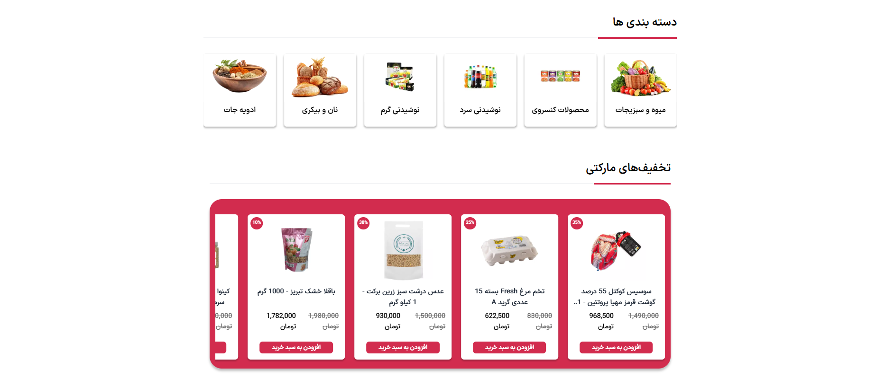
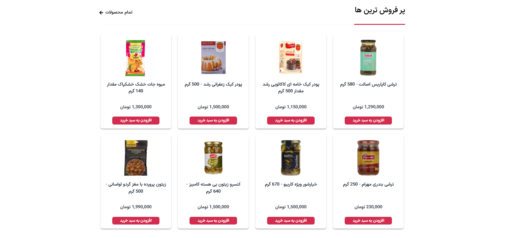
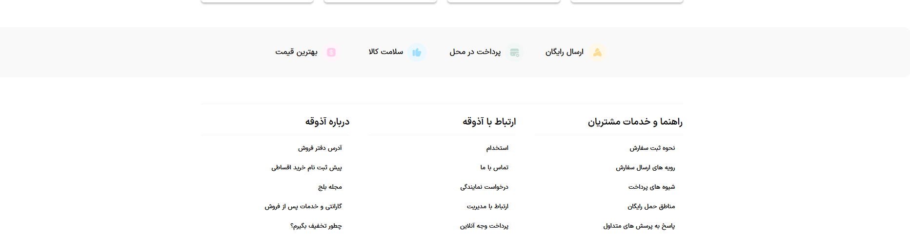
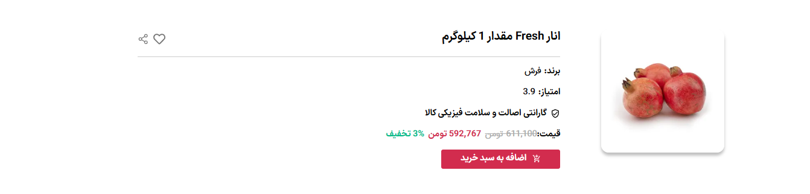
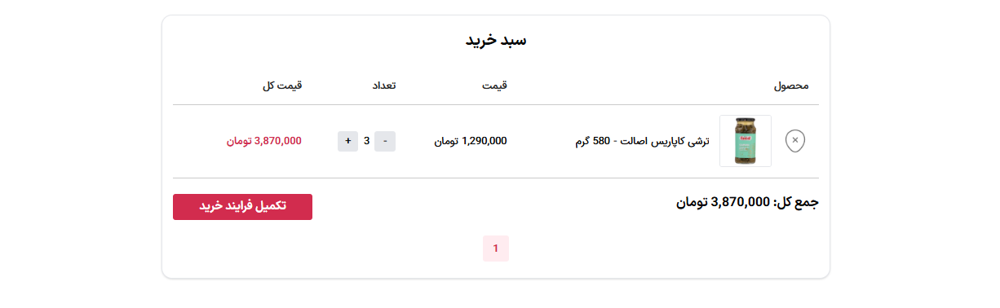
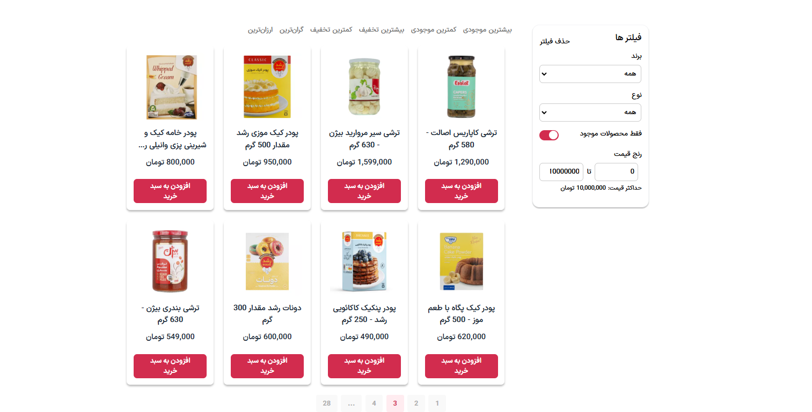

# 🍱 Azoghe – Online Grocery Store


---

## 📸 Screenshots

<p align="center">
  
  
  
  
  
  
  
</p>

---

## ℹ️ About the Project

Azoghe is a **modern online grocery store** built with **React, TypeScript, and Tailwind CSS**, offering a smooth and responsive shopping experience. It supports **PWA (Progressive Web App)** features, allowing users to install the app and use it offline.

---

## 🚀 Features

✅ **PWA Support** – Installable on mobile and works offline  
✅ **Modern UI** – Built with Tailwind CSS for a sleek look  
✅ **Fast & Lightweight** – Optimized performance for a smooth experience  
✅ **Product Categories** – Easily browse and search for products  
✅ **Storybook UI Documentation** – Well-documented components

---

## 🛠️ Backend Repository

Azoghe's backend is built separately to handle API requests, authentication, and order management.

🔗 **[Azoghe Backend Repository](https://github.com/h3nrzi/shop-flow)**
🔗 **[Azoghe Backend url]( https://azooghe.onrender.com)**

---

## 🌐 Live Demo

🔗 [Visit Azoghe](https://azogeh.onrender.com/)

---

## 🎨 Figma Design

The UI/UX design of Azoghe was created in **Figma**. Click the link below to view the design files:

🎨 **[View Figma File](https://www.figma.com/your-design-link)**

---

## 🛠️ Installation

### **1. Clone the Repository**

```bash
git clone https://github.com/m-mohammad-d/azoghe.git
cd azoghe
```

### **2. Install Dependencies**

```bash
npm install
```

### **3. Start the Development Server**

```bash
npm run dev
```

---

## 📖 Running Storybook

To view the **Storybook UI documentation**, follow these steps:

### **1. Install Storybook Dependencies**

```bash
npm install
```

### **2. Start Storybook**

```bash
npm run storybook
```

Storybook will start at: **http://localhost:6006/**

---

## 📜 License

This project is licensed under the **MIT License**.

---

💙 **Enjoy using Azoghe? Give it a star ⭐ on GitHub!**
